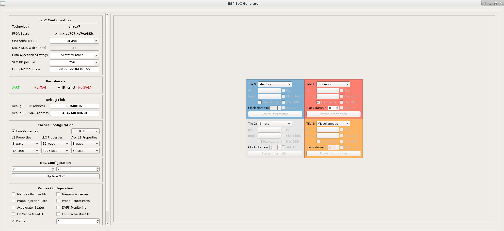
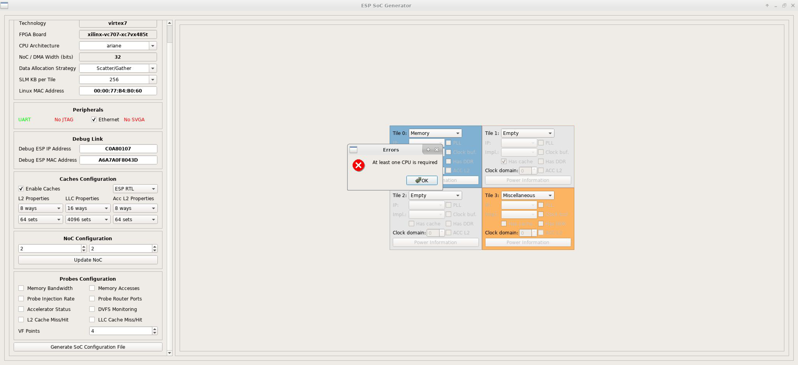
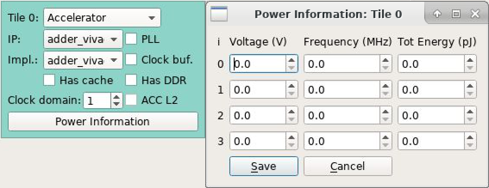
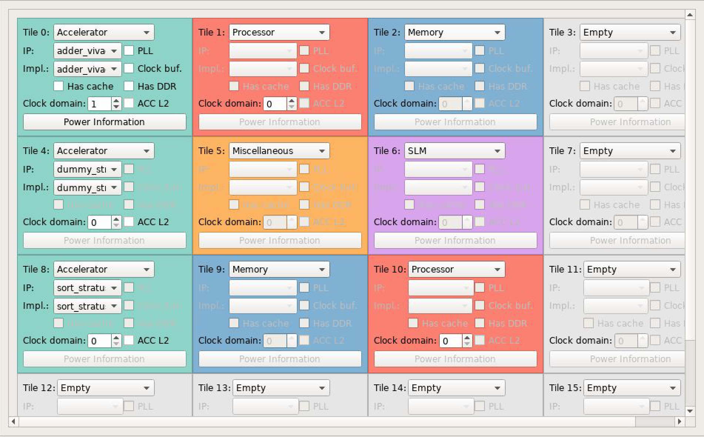
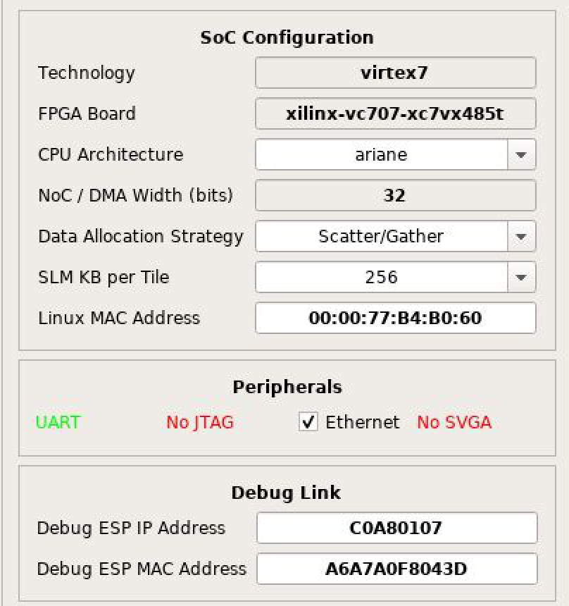
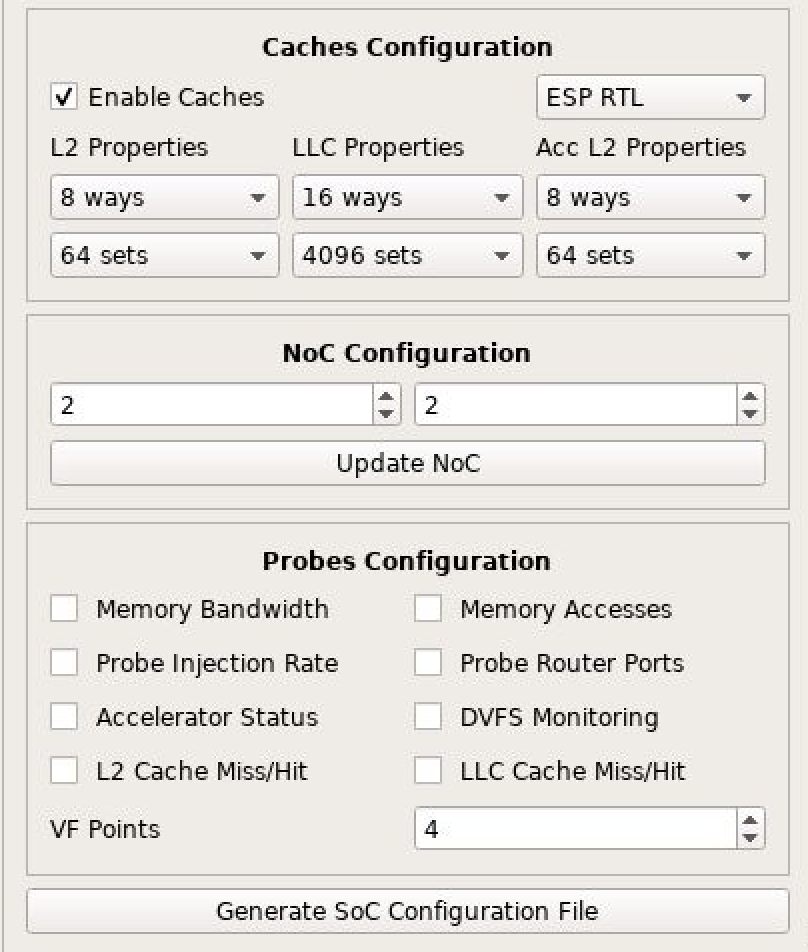

# Newsocmap

## Overview

This directory contains tools for configuring and generating an ESP SoC with a new GUI.

To make the GUI, enter the directory of an FGPA board (ex: `esp/socs/xilinx-vc707-xc7vx485t/`) and run `$ make newsocmap`.
To run the GUI, enter the directory of an FGPA board (ex: `esp/socs/xilinx-vc707-xc7vx485t/`) and run `$ make newsocmap-run`.

This directory is organized as follows:
* `espcreator.cpp` and `espcreator.h` contain the implementation of several parts of the GUI. These files initialize the various configuration options (such as the various checkboxes and dropdown menus), check that the SoC configuration created is valid, and generate the `.esp_config` and `.esp_config.bak.*` files.
* `tile.cpp` and `tile.h` contain the implementation of the individual tiles of the GUI. These files initialize each tile in the NoC configuration and contain functions that control the various options on each tile.
* `constants.h` contains constant values that are used by both `espcreator.cpp` and `tile.cpp`, such as the various options in the configuration options and conversions to abbreviate tile types for the generation of `.esp_config*` files.
* `espcreator.ui` handles the layout of the GUI (with the exception of the tiles). It is generated and edited by `/opt/qt/Tools/QtCreator/bin/qtcreator`.
* `main.cpp` runs the entire application. It can be run using `$ ./main <NOC_WIDTH> <TECH_LIB> <MAC_ADDRESS>`.
* `socmap_utils.cpp` and `socmap_utils.h` contain various miscellaneous functions used in `tile.cpp` and `address_map.cpp`.

## Running the GUI

- To run the GUI, enter the directory of an FGPA board (ex: `esp/socs/xilinx-vc707-xc7vx485t/`) and run `$ make newsocmap-run`.
- After configuring the SoC, clicking "Generate SoC Configuration File", and closing the GUI, the file generators in `esp/tools/socgen/` will then run to generate the files based off of `.esp_config.bak`.

## GUI Screenshots



Above is a screenshot of the equivalent of the starting setup in the original GUI (`esp/tools/socgen/`).


Above is a screenshot of the GUI that demonstrates the scrolling capabilities of the NoC.



Above is a screenshot of the GUI that demonstrates the checking on clicking "Generate SoC Configuration File".



Above is a screenshot of the "Power Information" window of a tile.


Above is a screenshot of the save prompt window.



Above is a screenshot of the scrolling feature of the tile grid. Once any dimension of the grid is greater than `3`, then scrollbars appear in the appropriate directions.



Above is the screenshot of the top half of the configuration options.



Above is the screenshot of the bottom half of the configuration options.

## To do/Known Issues

- Add descriptions of other files in this `README.md`
- Implement vendor names (ex: `sld`) for accelerators in `.esp_config*` files and check for correctness
- Make sure that `get_ip_acc()` and `get_impl_acc()` functions for accelerators in `.esp_config*` in `tile.cpp` correctly work for all accelerators
- Update “make targets” such as `esp-xconfig`, `esp-config` `esp-defconfig` to replace old GUI
- Fix the "Power Information" button for CPU with nonzero "Clock domain" values
- Lines corresponding to `case 8`, `case 10`, and `case 11` in `esp/socs/xilinx.../moc_espcreator.cpp` must be removed

## Dependencies
- Running `$ qmake-qt5 --version` returns
```
QMake version 3.1
Using Qt version 5.9.7 in /usr/lib64
```
